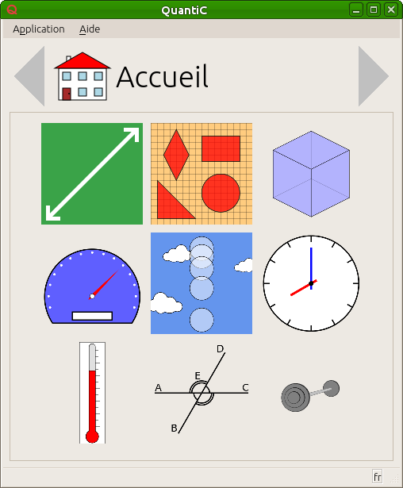
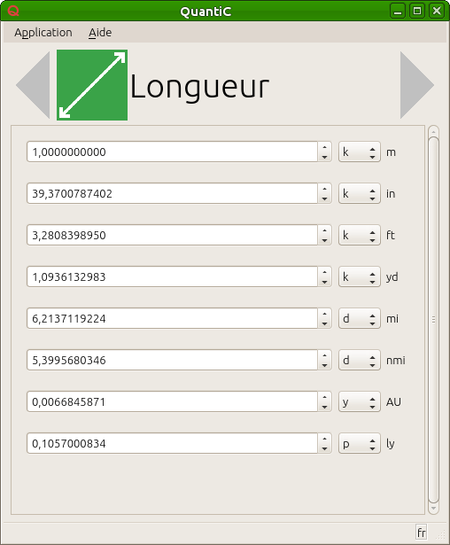

# QuantiC, the *Quant*ity *C*onverter
QuantiC is a quantity / unit converter as the name implies.
It is a desktop program written in [C++](https://en.wikipedia.org/wiki/C++) and [Qt](https://en.wikipedia.org/wiki/Qt_(software)).

The source code and the resources are GPL-licensed in version 2.

For [more informations](DOC.md), please refer to the documentation.
